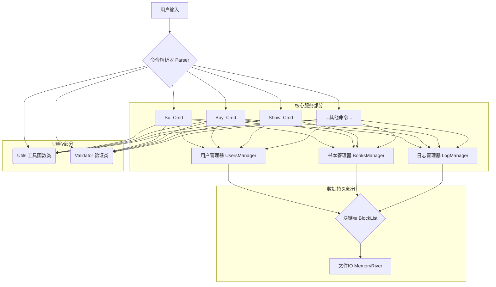

Bookstore 书店管理系统
-----------------------------
林乐逍

## 程序功能概述

一个书店管理系统，支持多用户使用，通过命令行进行交互。

## 主体逻辑说明

持续获取用户每一行的输入，进行解析，得到对应命令进行执行，直到用户输入 `exit` 或 `quit`。

## 代码文件结构

```
llx07/Bookstore-2025
├── include
│   ├── MemoryRiver.hpp
│   ├── BlockList.hpp
│   ├── Charset.hpp
│   ├── Commands
│   │   ├── BookCommands.hpp
│   │   ├── CommandBase.hpp
│   │   ├── LogCommands.hpp
│   │   └── UserCommands.hpp
│   ├── BooksManager.hpp
│   ├── LogManager.hpp
│   ├── UsersManager.hpp
│   ├── Parser
│   │   └── Parser.hpp
│   ├── Utils.hpp
│   └── Validator.hpp
└── src
    ├── Commands
    │   ├── BookCommands.cpp
    │   ├── LogCommands.cpp
    │   └── UserCommands.cpp
    ├── Parser
    │   ├── BookParser.cpp
    │   ├── LogParser.cpp
    │   ├── Parser.cpp
    │   └── UserParser.cpp
    ├── LogManager.cpp
    ├── BooksManager.cpp
    ├── UsersManager.cpp
    ├── server.cpp
    └── main.cpp
```

`main.cpp` 函数是程序的入口。通过在 `Parser.h` 中声明的 `parse_command` 函数，通过调用在 `*Parser.cpp` 中注册的
Handler，来获取命令。之后再对命令调用虚函数 `execute()` 进行执行。
`Session` 类保存所需的所有上下文，所有命令类的 `execute` 都接受一个 `Session` 作为参数，从而判断用户权限，修改数据库等。

## 功能设计

- 底层数据存储模块：
    - `MemoryRiver`：一个可以存储任意POD类型在文件中的类。
    - `BlockList`：利用 `MemoryRiver`，实现了键值对的插入删除和查询一个键所对应的全部的值。
- 数据管理模块 `Manager` ：提供对所需数据的高层封装：
    - `BooksManager`：一个Singleton，提供了对图书信息查询的封装，用多个 Blocklist实现多种不同的索引。
    - `UserManager`：一个Singleton，提供了对用户信息查询的封装，用Blocklist实现对 `UserID` 的索引。
    - `LogManager`：一个Singleton，提供了对日志信息查询的封装。
- 命令执行模块 `Commands`：所有命令。基类为 `Command`，有虚函数 `execute`，接受一个 `Session` 作为参数。
    - `BookCommands`：关于书本命令的实现。
    - `UserCommands`：关于用户命令的实现。
    - `LogCommands`：关于日志命令的实现。
- 命令解析模块
    - `Parser`：一个函数 `parseCommand`，解析一个 `std::vector<std::string>`，返回一个 `Command` 或抛出异常。
    - 通过 `Registry` 实现解析器的注册，并用 `std::multimap` 实现对应 Handler 的查找。
- Utility 模块：
    - `Validator`：帮助类，提供对字符串的校验。
    - `Utils`：存放所有帮助函数



## 数据库设计

- 用户信息 (user_data): 存储 User 结构体，包含用户ID、密码、用户名、权限，以及登录次，用一个 BlockList 实现。
- 书籍信息 (book_data): 存储 Book 结构体，包含 ISBN、书名、作者、关键词、单价、库存，用 MemoryRiver 实现。
    - 索引文件: 为快速查询，为每个数据建立了索引。每个索引都是一个独立的 BlockList 文件，其中存储了 "键-值"
      对（键是属性值，值是对应书籍在 book_data 中的位置）。
        - isbn_index: ISBN 到书籍位置的索引。
        - name_index: 书名到书籍位置的索引。
        - author_index: 作者到书籍位置的索引。
        - keyword_index: 关键词到书籍位置的索引。
- 日志数据 (log_*): 记录日志

## 类、结构体设计

### 实体数据结构模块

- `struct Book`：图书信息的实体结构，用于存储单本图书的详细信息。
    - 字段：
        - `ISBN`：`std::array<char, 21>`，ISBN。
        - `book_name`：`std::array<char, 61>`，书名。
        - `author`：`std::array<char, 61>`，作者。
        - `keywords`：`std::array<char, 61>`，关键词（以 `|` 分隔）。
        - `quantity`：`int`，库存数量。
        - `price`：`long long`，单价（通常以分为单位）。
- `struct User`：用户信息的实体结构。
    - 字段：
        - `userid`：`std::array<char, 31>`，用户账号/ID。
        - `username`：`std::array<char, 31>`，用户昵称。
        - `password`：`std::array<char, 31>`，登录密码。
        - `privilege`：`int`，权限等级（如 0, 1, 3, 7 等）。
        - `login_count`：`int`，记录该用户的登录次数。

### 业务逻辑管理模块 (Managers)

- `class BooksManager`：**单例类**，核心业务控制器，负责图书数据的持久化存储、多维度索引维护及业务操作。
    - 方法：
        - `getInstance()`：获取单例实例。
        - `get_books_with_[ISBN/name/author/keyword]()`：根据不同条件检索图书，返回 `vector<Book>`。
        - `create_book()`：仅基于 ISBN 创建新书条目。
        - `modify_book_data()`：修改图书信息（同时更新相关索引）。
        - `import_book()`：进货（增加库存）。
        - `buy_book()`：购买图书（减少库存）。
- `class UsersManager`：**单例类**，负责用户账户的管理、认证与权限控制。\
    - 方法：
        - `getInstance()`：获取单例实例。
        - `add_user()`：注册/添加新用户。
        - `is_password_correct()`：验证密码。
        - `modify_password()`：修改密码。
        - `get_user_by_userid()`：获取用户信息。
        - `erase_user()`：删除用户。
- `class LogManager`：**单例类**，负责财务日志的记录与查询。
    - 方法：
        - `getInstance()`：获取单例实例。
        - `add_finance_log()`：追加一笔财务记录。
        - `get_finance_log()`：查询最后 `cnt` 笔交易的总收支。

### Parser 模块

- `class HandlerRegistry`：命令解析注册表，实现字符串命令到处理函数的映射。
    - 方法：
        - `get_handler()`：根据命令动词（如 "buy", "show"）获取对应的解析器函数。
- `Global Function`: `parse_command()`：解析输入的 Token 列表，返回具体的 `Command` 对象指针。

### 命令模式模块 (Commands)

- `class Command`：所有指令的抽象基类。
    - 方法：`execute(Session& session)`：纯虚函数，执行具体逻辑。
    - 异常：`ExecutionException`。

- 具体的命令类
    - `class ShowCommand`：处理 `show` 指令，支持多种筛选参数（ISBN, name, author, keyword）。
    - `class BuyCommand`：处理 `buy` 指令，执行购买操作并记录日志。
    - `class SelectCommand`：处理 `select` 指令，选中图书以进入子模式。
    - `class ModifyCommand`：处理 `modify` 指令，修改当前选中图书的属性。
    - `class ImportCommand`：处理 `import` 指令，进货并记录交易支出。
    - `class SwitchUserCommand`：处理 `su` 指令，用户登录或切换。
    - `class LogoutCommand`：处理 `logout` 指令。
    - `class RegisterCommand`：处理 `register` 指令。
    - `class ChangePasswordCommand`：处理 `passwd` 指令。
    - `class AddUserCommand`：处理 `useradd` 指令。
    - `class DeleteUserCommand`：处理 `delete` 指令。
    - `class ShowFinanceCommand`：处理 `show finance` 指令。

### 工具与验证模块

- `class expect<T>`：链式调用的验证器类，用于参数校验。
    - 方法：`toBe()`, `le()`, `ge()`, `consistedOf()`, `toMatch()` 等，支持 `Not()` 取反。
- `namespace util`：通用工具函数集合。
    - 函数：`split()` (字符串分割), `toInt()` (字符串转整数), `toDecimal()` (字符串转浮点金额), `to_array()` (string 转 array)。

## 其他补充说明

目前系统的密码明文存储在硬盘上，敬请注意。
