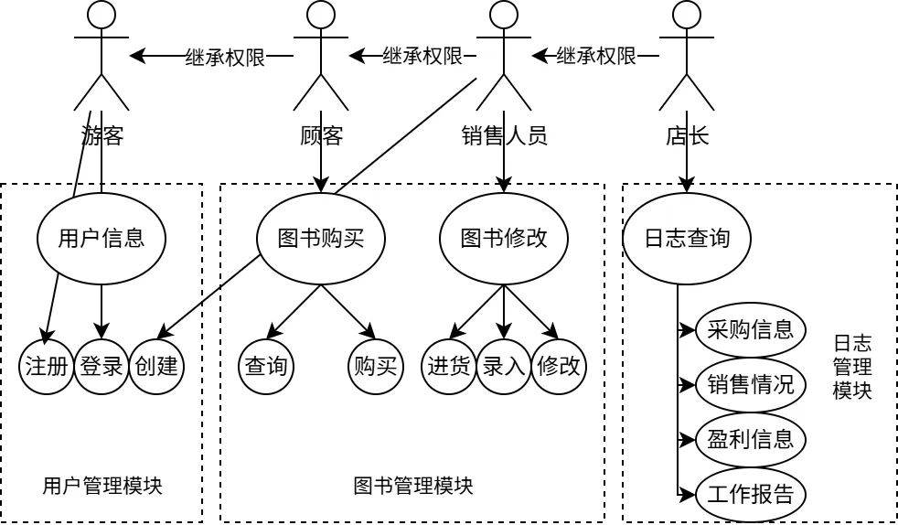
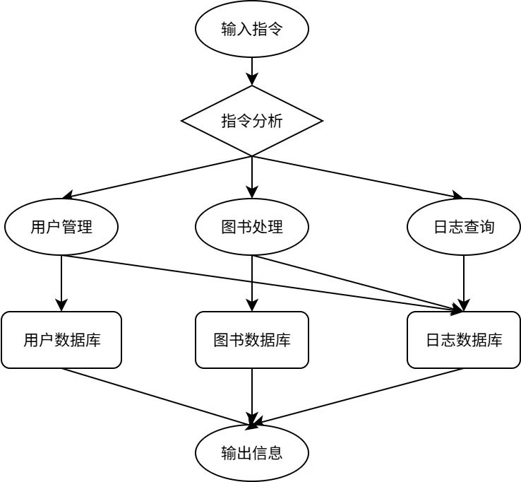

## 业务流图

## 数据流图

## 数据词典

### 用户数据库

|  字段  |    类型    |      说明      |
|:----:|:--------:|:------------:|
| 用户ID | Char(30) |   用户唯一标识，不重复   |
|  昵称  | Char(30) |              |
|  密码  | Char(30) |              |
| 权限等级 |   Byte   | 用一个字节存储用户的权限 |

### 图书数据库

|  字段   |    类型    |     说明      |
|:-----:|:--------:|:-----------:|
|  图书ID  |  INT32   |   图书唯一标识，不重复    |
| ISBN号 | Char(20) |             |
|  书名   | Char(60) | 只包含ASCII内字符 |
|  作者   | Char(60) | 只包含ASCII内字符 |
|  关键字  | Char(60) | 只包含ASCII内字符 |
|  库存量  |  UINT32  |             |
|  价格   |  UINT64  |    以分为单位    |

### 日志数据库

|  字段  |    类型     |   说明    |
|:----:|:---------:|:-------:|
| 日志ID |   INT32   | 日志的唯一标识，不重复 |
| 用户ID |   INT32   | 该操作的执行者 |
| 指令信息 | Char(256) | 具体执行的指令 |

## 功能说明与用户交互设计

以下分别用 0/1/2/3 表示游客，顾客，销售人员，店长的权限等级。
括号内数字是能执行该命令的最小权限等级。 

### 用户信息模块

- （0）功能 1. 登录账户：
  - 输入：用户ID，密码
  - 输出：是否登录成功
  - 处理：从用户数据库查询ID和密码是否正确
  - 命令格式：`su [ID] [password]`
- （0）功能 2. 注册账户：
  - 输入：用户ID，昵称，密码
  - 输出：是否注册成功
  - 处理：查询用户ID是否存在。如果不存在新建账户，权限为顾客。
  - 命令格式：`reg [ID] [username] [password]`
- （2）功能 3. 创建账户：
  - 输入：用户ID，昵称，密码，权限等级
  - 输出：是否创建成功
  - 处理：要求用户ID不存在，且权限等级不能高于现在的等级
  - 命令格式：`creusr [ID] [username] [password] [privilige]`
- （3）功能 4. 删除账户：
  - 输入：用户ID
  - 输出：是否删除成功
  - 处理：要求，用户ID存在且用户不能已经登录
  - 命令格式：`delusr [ID]`

### 图书数据模块

- （1）功能 1. 查询图书：
  - 输入：图书ISBN/图书名称/图书作者/图书关键词
  - 输出：所有满足条件的图书信息
  - 处理：从图书数据库中查询所有满足条件的图书，并输出
  - 命令格式：`query (--ISBN=[ISBN]|--name=[NAME]|--author=[AUTHOR]|--keyword=[KEYWORD]`
- （1）功能 2. 购买图书：
  - 输入：图书ISBN，购买数量
  - 输出：是否购买成功
  - 处理：检查是否存在该图书，并检查库存是否足够
  - 命令格式：`buy [ISBN] [count]`
- （2）功能 3. 修改图书：
  - 输入：原来的图书信息，新的图书信息
  - 输出：是否修改成功
  - 处理：检查新的信息是否合法，并更新图书数据库的信息
  - 命令格式：`modify [ISBN_before] [new_data]`
- （2）功能 4. 进货图书： 
  - 输入：图书ISBN，进货数量
  - 输出：是否操作成功
  - 处理：检查信息是否合法，并更新库存信息、
  - 命令格式：`import [ISBN] [count]`

### 日志信息模块

- （3）功能 1. 财务记录查询：
  - 输入：查询的交易范围，空表示查询全部
  - 输出：一段时间内的收支信息
  - 处理：读取日志信息最近若干笔的交易信息，并计算总和
  - 命令格式：`finlog [count]?`
- （3）功能 2. 生成日志：
  - 输入：显示日志的范围，空表示输出全部
  - 输出：日志信息
  - 处理：输出日志的最后若干条
  - 命令格式：`showlog [count]?`

